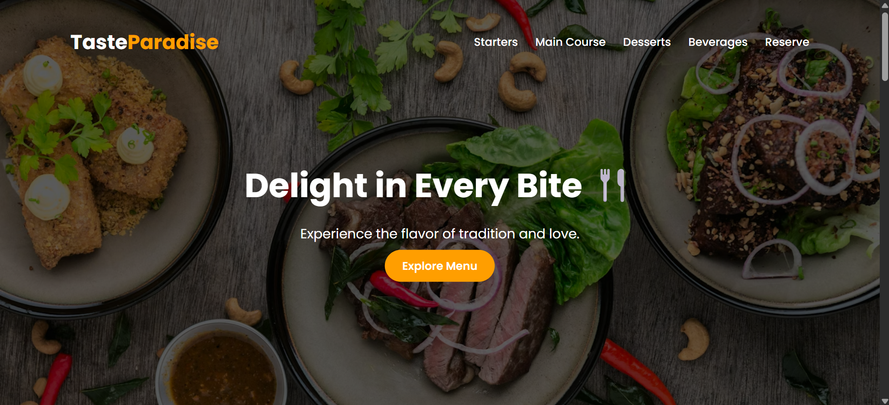
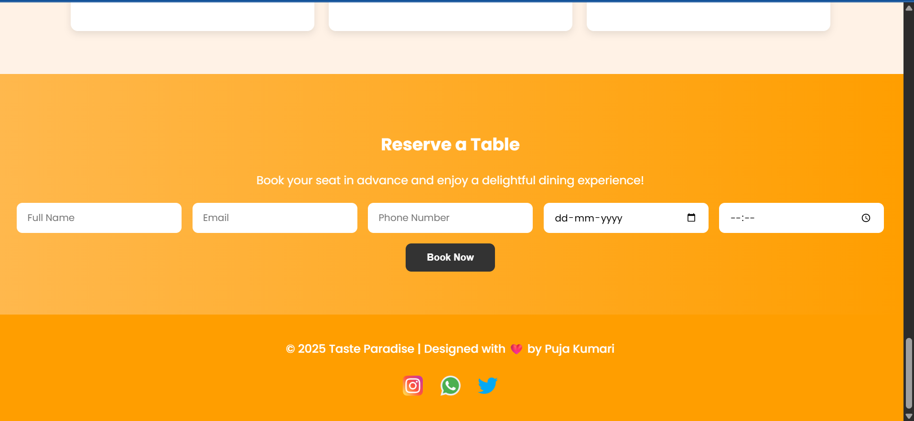

# 🍽️ Taste Paradise – Restaurant Menu Website

Welcome to **Taste Paradise**, a stylish and fully responsive restaurant menu website built using **pure HTML and CSS**.  
This project combines elegant design, smooth animations, and a clean layout to give users a delightful digital dining experience. 🌿✨  

---

## 🧠 About the Project

This is a simple yet attractive **one-page restaurant menu** that displays different food categories such as:
- 🥗 Starters  
- 🍛 Main Course  
- 🍰 Desserts  
- ☕ Beverages  

It also includes:
- A beautiful **Hero section**
- **Parallax effect** for visual depth
- **Chef’s Special** highlight section
- **Customer Reviews**
- A functional **Reservation Form**
- A minimal **Footer with social icons**

---

Features

✨ **Modern Design** — Clean typography, rich colors, and balanced spacing.  
📱 **Responsive Layout** — Fully optimized for mobiles, tablets, and desktops.  
🎞️ **Smooth Animations** — Subtle transitions that make the experience engaging.  
🌈 **Custom Sections** — From food categories to user testimonials and reservation form.  
🧑‍🍳 **Chef’s Special** — Highlights the restaurant’s best dish.  
🧾 **Easy to Customize** — Just edit text, images, and prices in HTML.  

Technologies Used
HTML5- Structure of the website 
CSS3 -Styling, layout, animations, and responsiveness 
Google Fonts - Clean and modern typography
Unsplash -Free high-quality food background images 

Preview

Here’s a sneak peek 👀 of what the website looks like:

  
  

