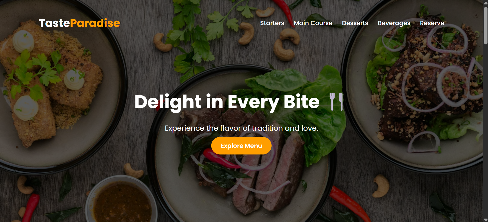
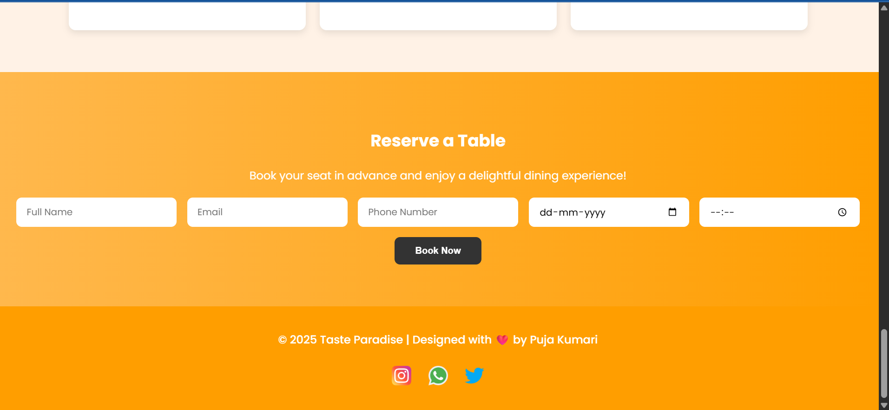

🍽️ Taste Paradise — Restaurant Menu Website

A stylish, fully responsive restaurant menu website built with pure HTML and CSS. Taste Paradise combines elegant design, smooth animations, and a clean layout to deliver a delightful digital dining experience. 🌿✨

   

📖 About the Project

Taste Paradise is a simple yet visually striking one-page restaurant menu website that showcases food across multiple categories:

🥗 Starters
🍛 Main Course
🍰 Desserts
🥤 Beverages

It also includes several polished sections to make the site feel like a complete restaurant experience:

Hero Section — an eye-catching introduction to the restaurant
Parallax Effect — subtle scroll-based depth for visual richness
Chef's Special — a dedicated highlight for the restaurant's signature dish
Customer Reviews — testimonials that build trust and credibility
Reservation Form — a functional form for booking a table
Footer — a minimal footer with social media icons
✨ Features
Feature	Description
🎨 Modern Design	Clean typography, rich colors, and balanced spacing
📱 Responsive Layout	Fully optimized for mobile, tablet, and desktop screens
🎬 Smooth Animations	Subtle transitions that keep the experience engaging
🧩 Custom Sections	Food categories, testimonials, and a reservation form
⭐ Chef's Special	A spotlighted section for the restaurant's best dish
🛠️ Easy to Customize	Just edit the text, images, and prices in the HTML
🧰 Technologies Used
HTML5 — structure of the website
CSS3 — styling, layout, animations, and responsiveness
Google Fonts — clean, modern typography
Unsplash — free, high-quality food background images
🚀 Getting Started

To run this project locally:

bash
# Clone the repository
git clone https://github.com/your-username/taste-paradise.git

# Navigate into the project folder
cd taste-paradise

# Open index.html in your browser

No build tools or dependencies required — it's pure HTML & CSS, so it runs straight out of the box.

🖼️ Preview

Here's a sneak peek 👀 of what the website looks like:

   

📂 Project Structure
taste-paradise/
├── index.html
├── style.css
├── img1.png
├── img2.png
└── README.md
🛠️ Customization

Want to make it your own? Here's where to look:

Menu items & prices — edit the relevant <section> blocks in index.html
Images — replace img1.png, img2.png, etc. with your own restaurant photos
Colors & fonts — update the CSS variables and font imports in style.css
Reservation form — connect the form to your preferred backend or form service (e.g., Formspree, Netlify Forms)
👩‍💻 Author

Puja

Made with ❤️ for food lovers everywhere

